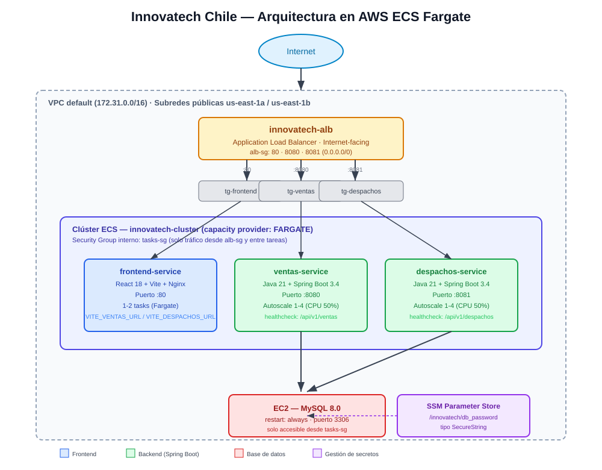

# 01. Arquitectura del Sistema

## Visión general

Innovatech Chile está compuesta por tres microservicios desacoplados y una base de datos relacional:

| Componente | Tecnología | Puerto | Rol |
|---|---|---|---|
| `frontend-service` | React + Nginx | 80 | Interfaz de usuario (dashboard) |
| `ventas-service` | Spring Boot | 8080 | Lógica de negocio de ventas, API REST |
| `despachos-service` | Spring Boot | 8081 | Lógica de negocio de despachos, API REST |
| Base de datos | MySQL 8.0 (en EC2) | 3306 | Persistencia relacional |

## Diagrama de arquitectura



Representación en texto (referencia rápida):

```
                         Internet
                            │
                            ▼
                   innovatech-alb (ALB)
              :80        :8080        :8081
                │           │            │
                ▼           ▼            ▼
        frontend-service  ventas-service  despachos-service
        (React + Nginx)   (Spring Boot)   (Spring Boot)
        1-2 tasks         autoscale 1-4    autoscale 1-4
                │           │            │
                └─────┬─────┴──────┬─────┘
                      ▼            ▼
              Clúster ECS — innovatech-cluster (Fargate)
                            │
                            ▼
                 EC2 — MySQL 8.0 (restart:always)
```

## Comunicación entre componentes

- El **frontend** consume las APIs REST de `ventas-service` y `despachos-service` mediante llamadas HTTP a través del Application Load Balancer, que expone rutas diferenciadas por puerto (`:8080` para ventas, `:8081` para despachos).
- Las URLs de la API se leen mediante **variables de entorno de Vite en tiempo de build** (no quedan hardcodeadas en el código, lección aprendida tras un problema real detectado en EP3).
- `ventas-service` y `despachos-service` se conectan a la base de datos MySQL alojada en una instancia EC2, usando credenciales inyectadas como *secret* desde SSM Parameter Store (ver `05-secretos-y-configuracion.md`).
- La comunicación entre las tareas de ECS y la base de datos está restringida a nivel de red mediante Security Groups (ver `06-seguridad.md`).

## Elección del proveedor Cloud: AWS

Se eligió **AWS** como proveedor cloud por:

- Acceso disponible a través del entorno académico (AWS Academy Learner Lab).
- Disponibilidad de servicios administrados directamente relevantes para el curso: **ECS Fargate** (orquestación sin gestión de servidores), **ECR** (registro de imágenes privado), **ALB** (balanceo de carga con health checks nativos), **SSM Parameter Store** (gestión de secretos) y **CloudWatch** (logs y métricas).
- Fargate permite desplegar contenedores sin administrar instancias EC2 subyacentes, lo que simplifica la operación y el escalado de los tres microservicios.

## Evolución del proyecto (EP2 → EP3/EFT)

| Aspecto | EP2 (manual) | EP3 / EFT (orquestado) |
|---|---|---|
| Registro de imágenes | Docker Hub | Amazon ECR (privado) |
| Despliegue | 3 instancias EC2 manuales, vía AWS SSM | Clúster ECS + Fargate, administrado |
| Balanceo de carga | Ninguno, IP pública cambiante | Application Load Balancer con DNS estable |
| Escalado | Ninguno | Autoscaling real (Target Tracking, CPU 50%) |
| Recuperación ante fallos | Manual | Automática (ECS reemplaza tareas fallidas) |
| Pipeline | Parcial | 100% automatizado: commit → deploy |

> Esta tabla es útil tanto para el informe como para justificar en la defensa por qué se eligió un orquestador frente a un despliegue manual (ver también `08-analisis-critico-y-lecciones.md`).
