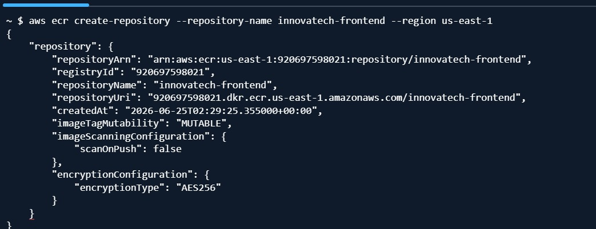

# 02. Contenedorización de la Solución

## Estructura real del repositorio

```
ISY1101-EP2-Innovatech/
├── .github/workflows/deploy.yml
├── back-Ventas_SpringBoot/       (Java 21 + Spring Boot 3.4)
├── back-Despachos_SpringBoot/    (Java 21 + Spring Boot 3.4)
├── front_despacho/               (React 18 + Vite + Nginx)
├── docker-compose.yml
├── evidencias.pdf
└── README.md
```

> **Nota:** solo existe una carpeta de frontend (`front_despacho`); confirma si esta SPA consume ambas APIs (ventas y despachos) desde un único proyecto React, para dejarlo explícito en el informe.

## Imágenes Docker por componente

- **`back-Ventas_SpringBoot/Springboot-API-REST/Dockerfile`** y **`back-Despachos_SpringBoot/Springboot-API-REST-DESPACHO/Dockerfile`** → build del `.jar` con Java 21/Maven en una etapa, y ejecución en una imagen final más liviana (JRE), corriendo con **usuario no root** (buena práctica de seguridad explícita en el proyecto). Estas son las rutas de contexto exactas usadas en `deploy.yml`.
- **`front_despacho/Dockerfile`** → build de la app React 18 + Vite con Node, y etapa final servida con **Nginx**.

### Buenas prácticas aplicadas (confirmadas en el repo)

- **Multi-stage build** en los 3 servicios: separa la etapa de compilación de la etapa de ejecución.
- **Usuario no root** dentro de los contenedores (reduce el impacto de una posible vulnerabilidad de ejecución de código).
- **Variables de entorno en tiempo de build** para el frontend: `VITE_VENTAS_URL` y `VITE_DESPACHOS_URL`, definidas en `.env` y leídas por Vite al compilar — reemplazan URLs hardcodeadas de desarrollo local (`192.168.x.x`) que existían antes de una corrección aplicada durante el proyecto.
- **`.dockerignore`:** excluye archivos innecesarios (`node_modules`, `target/`, `.git`, `.env` locales) del contexto de build.

## Orquestación local con Docker Compose

Para el entorno de desarrollo local se utiliza el archivo `docker-compose.yml` (real, tal como está en el repositorio), que levanta los tres servicios más la base de datos MySQL en una red interna común (`innovatech-net`), permitiendo probar la integración completa antes de desplegar en la nube.

```yaml
version: '3.8'
services:
  frontend:
    build: ./front_despacho
    container_name: frontend
    ports:
      - "80:80"
    networks:
      - innovatech-net
    depends_on:
      - backend-ventas
      - backend-despachos
    restart: always

  backend-ventas:
    build: ./back-Ventas_SpringBoot/Springboot-API-REST
    container_name: backend-ventas
    ports:
      - "8080:8080"
    environment:
      - DB_ENDPOINT=mysql
      - DB_PORT=3306
      - DB_NAME=innovatech_db
      - DB_USERNAME=innovatech
      - DB_PASSWORD=innovatech123
    networks:
      - innovatech-net
    depends_on:
      - mysql
    restart: always

  backend-despachos:
    build: ./back-Despachos_SpringBoot/Springboot-API-REST-DESPACHO
    container_name: backend-despachos
    ports:
      - "8081:8081"
    environment:
      - DB_ENDPOINT=mysql
      - DB_PORT=3306
      - DB_NAME=innovatech_db
      - DB_USERNAME=innovatech
      - DB_PASSWORD=innovatech123
    networks:
      - innovatech-net
    depends_on:
      - mysql
    restart: always

  mysql:
    image: mysql:8.0
    container_name: mysql
    environment:
      - MYSQL_ROOT_PASSWORD=root123
      - MYSQL_DATABASE=innovatech_db
      - MYSQL_USER=innovatech
      - MYSQL_PASSWORD=innovatech123
    volumes:
      - mysql-data:/var/lib/mysql
    networks:
      - innovatech-net
    restart: always

networks:
  innovatech-net:
    driver: bridge

volumes:
  mysql-data:
    driver: local
```

> ⚠️ **Nota importante para la defensa — no es una contradicción:** las credenciales aquí están en texto plano (`innovatech123`, `root123`) a propósito, porque este archivo es **exclusivamente para desarrollo local**, donde no hay exposición a internet. En el entorno de **producción en AWS**, estas mismas credenciales **no se usan**: la contraseña real de la base de datos se gestiona mediante **SSM Parameter Store** como `SecureString` (ver `05-secretos-y-configuracion.md`). Si el docente pregunta por esta diferencia, la respuesta correcta es distinguir claramente entre configuración de desarrollo local (`docker-compose.yml`) y configuración de producción (Task Definition + SSM).

## Registro de imágenes: Amazon ECR

Se crearon **3 repositorios privados en Amazon ECR** (uno por microservicio: `innovatech-frontend`, `innovatech-ventas`, `innovatech-despachos`), mediante `aws ecr create-repository` ejecutado desde AWS CloudShell. El flujo de publicación, automatizado en el pipeline (ver `03-cicd.md`), es:

1. `docker build` de cada imagen con multi-stage build (vía `docker/build-push-action@v5`).
2. Autenticación contra el registro con `aws-actions/amazon-ecr-login@v2`.
3. `docker push` de las 3 imágenes al registro.

> ⚠️ **Importante — reconocer en la defensa:** actualmente las imágenes se publican únicamente con el tag `latest`, sin un tag de versión ligado al commit. Esto es una limitación real frente a lo que pide la rúbrica ("uso de tags/versionado para la trazabilidad"). Ver la propuesta de mejora en `03-cicd.md`.

**Evidencia real:**


