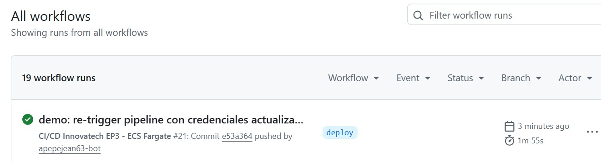

# 03. Pipeline de Integración y Entrega Continua (CI/CD)

## Flujo general

El pipeline está implementado con **GitHub Actions** y se ejecuta automáticamente ante cada `git push` a la rama `deploy`. El flujo completo es:

```
git push (rama deploy)
        │
        ▼
1. Checkout del código               → actions/checkout@v4
        │
        ▼
2. Configure AWS credentials         → aws-actions/configure-aws-credentials@v4
        │
        ▼
3. Login a Amazon ECR                → aws-actions/amazon-ecr-login@v2
        │
        ▼
4. Build + Push Frontend             → docker/build-push-action@v5
        ▼
5. Build + Push Backend Ventas       → docker/build-push-action@v5
        ▼
6. Build + Push Backend Despachos    → docker/build-push-action@v5
        │
        ▼
7. Forzar nuevo despliegue Frontend   → aws ecs update-service --force-new-deployment
        ▼
8. Forzar nuevo despliegue Ventas     → aws ecs update-service --force-new-deployment
        ▼
9. Forzar nuevo despliegue Despachos  → aws ecs update-service --force-new-deployment
```

- **Archivo real:** `.github/workflows/deploy.yml`
- **Nombre del workflow:** `CI/CD Innovatech EP3 - ECS Fargate`
- **Disparador (`on`):** `push` a la rama `deploy`.
- **Variables de entorno del workflow:** `AWS_REGION=us-east-1`, `ECS_CLUSTER=innovatech-cluster`.
- **100% automatizado:** build → push → deploy, sin intervención manual.
- **Duración promedio:** ~2-3 minutos por ejecución.
- **Intervenciones manuales en AWS por deploy:** 0.

### Detalle de cada etapa

| # | Step | Acción usada | Qué hace |
|---|---|---|---|
| 1 | Checkout código | `actions/checkout@v4` | Descarga el código del repositorio al runner |
| 2 | Configure AWS credentials | `aws-actions/configure-aws-credentials@v4` | Inyecta `AWS_ACCESS_KEY_ID`, `AWS_SECRET_ACCESS_KEY` y `AWS_SESSION_TOKEN` desde GitHub Secrets (credenciales temporales del AWS Academy Learner Lab) |
| 3 | Login a Amazon ECR | `aws-actions/amazon-ecr-login@v2` | Autentica Docker contra el registro privado de ECR y expone `steps.login-ecr.outputs.registry` |
| 4 | Build y Push Frontend | `docker/build-push-action@v5` | Construye la imagen desde `./front_despacho` y la publica como `innovatech-frontend:latest` |
| 5 | Build y Push Backend Ventas | `docker/build-push-action@v5` | Construye desde `./back-Ventas_SpringBoot/Springboot-API-REST` y publica `innovatech-ventas:latest` |
| 6 | Build y Push Backend Despachos | `docker/build-push-action@v5` | Construye desde `./back-Despachos_SpringBoot/Springboot-API-REST-DESPACHO` y publica `innovatech-despachos:latest` |
| 7-9 | Forzar nuevo despliegue (×3) | `aws ecs update-service --force-new-deployment` | Obliga a ECS a reemplazar las tareas en ejecución de `frontend-service`, `ventas-service` y `despachos-service` con la nueva imagen |

### Nota importante para la defensa: el pipeline no usa tags de versión

Actualmente las 3 imágenes se publican siempre con el tag **`latest`**. Esto significa que **no hay trazabilidad por versión/commit** entre lo que está corriendo en ECS y el código que lo generó — algo que la rúbrica pide explícitamente ("uso de tags/versionado para la trazabilidad de las imágenes"). Es honesto reconocer esta limitación en la defensa y mencionar la mejora: usar como tag el SHA corto del commit (`${{ github.sha }}`) además de `latest`, por ejemplo:

```yaml
tags: |
  ${{ steps.login-ecr.outputs.registry }}/innovatech-frontend:latest
  ${{ steps.login-ecr.outputs.registry }}/innovatech-frontend:${{ github.sha }}
```

### Nota sobre "Test" en el pipeline

El workflow actual **no incluye una etapa explícita de tests automatizados** antes del build. Si no se implementaron pruebas automatizadas (unitarias/integración), es mejor reconocerlo directamente en la defensa y explicar que la verificación de funcionamiento se hizo de forma manual (revisión de endpoints, logs y health checks tras cada despliegue) — ver `07-observabilidad.md`.

## Gestión de secretos en el pipeline

- Las credenciales de AWS (Access Key, Secret Key, y en el contexto del AWS Academy Learner Lab, el Session Token) se almacenan como **GitHub Secrets**, nunca en el código del workflow.
- Estas credenciales son inyectadas en tiempo de ejecución mediante variables de entorno del job, y se descartan al finalizar la ejecución.

## Versionado y trazabilidad

Ver la nota "El pipeline no usa tags de versión" arriba — es el punto más importante a mejorar y a reconocer con honestidad en la defensa.

## Evidencia de ejecución

Se cuenta con evidencia de un **run #21 exitoso** en GitHub Actions, ejecutado tras refrescar las credenciales del AWS Academy Learner Lab (las credenciales de este entorno académico expiran cada 4 horas, lo que generó fallas de IAM/ECR deny en ejecuciones previas — ver `08-analisis-critico-y-lecciones.md`).

## Otro problema real resuelto en el pipeline

Además de los problemas de infraestructura, se enfrentó un conflicto de Git: un `git push` fue **rechazado por non-fast-forward** porque la rama `deploy` en GitHub tenía commits que no estaban en el repositorio local. Se resolvió con `git pull` y la resolución manual del conflicto directamente en `deploy.yml`. Este tipo de incidente es normal en trabajo colaborativo con Git y vale la pena mencionarlo en la defensa como evidencia de manejo real de control de versiones, no solo de "código que funciona".


