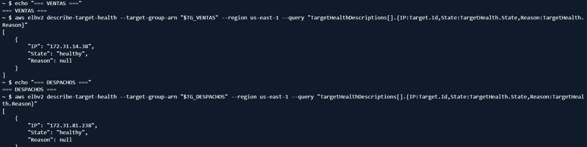
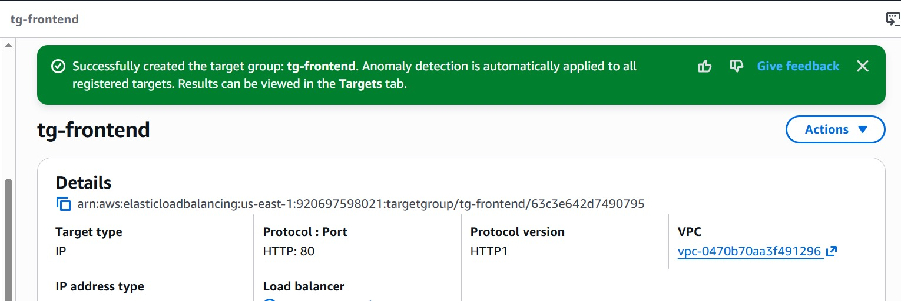
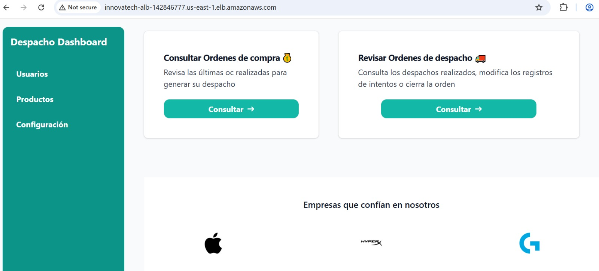

# 04. Infraestructura en la Nube (AWS)

## Componentes utilizados

| Servicio AWS | Uso en el proyecto |
|---|---|
| **VPC** | VPC default (`172.31.0.0/16`), 2 subredes públicas (`us-east-1a`, `us-east-1b`) |
| **Security Groups** | `alb-sg` (público, 80/8080/8081) y `tasks-sg` (interno) — ver `06-seguridad.md` |
| **Amazon ECR** | Registro privado de las 3 imágenes Docker |
| **Amazon ECS + Fargate** | Orquestación de los 3 microservicios, sin administrar servidores. Clúster: `innovatech-cluster`, capacity provider `FARGATE` |
| **Application Load Balancer (ALB)** | `innovatech-alb`, balancea tráfico hacia los 3 Target Groups |
| **Target Groups** | `tg-frontend` (:80), `tg-ventas` (:8080), `tg-despachos` (:8081) |
| **EC2** | Aloja MySQL 8.0 en contenedor Docker con `restart: always` |
| **SSM Parameter Store** | Almacena `/innovatech/db_password` (SecureString) |
| **CloudWatch** | Logs y métricas del entorno desplegado |
| **IAM** | `LabRole` (rol genérico del entorno AWS Academy Learner Lab) |

## Application Load Balancer y Target Groups

Se configuraron **3 Target Groups**, uno por microservicio, cada uno con su puerto correspondiente. El `innovatech-alb` quedó en estado **Active** y de tipo **Internet-facing**, exponiendo los 3 puertos (`:80`, `:8080`, `:8081`) hacia internet.

Los health checks de cada Target Group se configuraron apuntando a endpoints reales de la API (por ejemplo `/api/v1/ventas` y `/api/v1/despachos`), tras detectar que un health check apuntando solo a `/` generaba errores 502 (ver análisis crítico).

## Orquestación: Amazon ECS con Fargate

Se eligió **Fargate** sobre EC2 launch type porque:

- Elimina la necesidad de administrar, parchear o escalar instancias EC2 para correr los contenedores.
- El clúster `innovatech-cluster` gestiona automáticamente el ciclo de vida de las tareas: si una tarea falla o se detiene, ECS la reemplaza automáticamente (recuperación ante fallos verificada deteniendo una tarea a propósito).
- Permite asociar directamente el autoscaling a métricas de CPU sin gestionar el escalado de instancias subyacentes.

### ¿Por qué un orquestador y no un despliegue manual?

Frente al despliegue manual usado en EP2 (instancias EC2 configuradas a mano, sin autoscaling, con IP pública cambiante en cada sesión), ECS + Fargate aporta:

- **Recuperación automática:** una tarea caída se reemplaza sola, sin intervención humana.
- **Escalado dinámico:** el número de tareas sube o baja según la carga real (ver más abajo).
- **DNS estable:** el ALB entrega un endpoint fijo, a diferencia de una IP pública que cambiaba en cada sesión del Lab.
- **Despliegues sin downtime:** `force-new-deployment` reemplaza tareas de forma controlada.

## Autoscaling

Configuración de **Target Tracking Scaling** aplicada a `ventas-service` y `despachos-service`:

- **Métrica:** `ECSServiceAverageCPUUtilization`
- **Umbral objetivo:** 50% de CPU
- **Rango:** mínimo 1 — máximo 4 tareas

**Evidencia real:** bajo carga sostenida de 4 minutos, ECS incrementó automáticamente el `desiredCount` de `ventas-service` de 1 a 2 tareas, sin intervención manual, y las nuevas tareas alcanzaron el estado `healthy` en su Target Group correspondiente.

También como evidencia del despliegue activo y balanceo:

