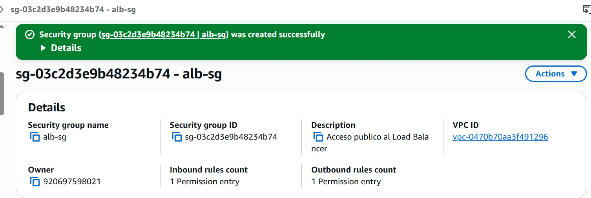
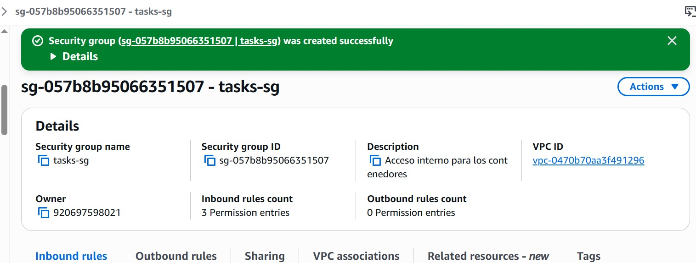
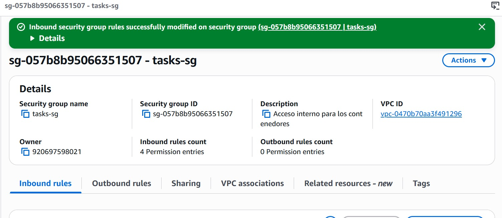

# 06. Seguridad Básica

## Security Groups (segmentación de red)

Se aplicó el principio de **mínimo privilegio a nivel de red** mediante dos Security Groups diferenciados:

| Security Group | Alcance | Reglas |
|---|---|---|
| `alb-sg` | Público | Permite tráfico entrante desde `0.0.0.0/0` hacia el ALB en los puertos **80, 8080 y 8081** |
| `tasks-sg` | Interno | Solo permite tráfico entre las tareas de ECS y desde `alb-sg`; regla outbound "All traffic" para que las tareas se conecten a servicios externos (ECR, SSM, MySQL) |

**Base de datos MySQL:** el puerto **3306 solo acepta conexiones desde `tasks-sg`**. No existe acceso público directo a la base de datos.

**Evidencia de configuración real:**

### Decisión de diseño consciente: por qué 8080 y 8081 también son públicos en el ALB

A diferencia de una arquitectura típica donde solo el puerto 80 (frontend) sería público, aquí el **frontend es una SPA de React**: las llamadas a las APIs de ventas y despachos ocurren **directamente desde el navegador del usuario**, no desde un servidor intermedio. Por eso el ALB necesita exponer también los puertos de los backends (`8080`, `8081`), no solo el `80`.

Esto se detectó como una limitación real durante el desarrollo (errores de `CORS` / `ERR_CONNECTION_TIMED_OUT` cuando esos puertos solo aceptaban tráfico interno), y se resolvió abriéndolos a `0.0.0.0/0` en `alb-sg`.

**Es importante reconocer esto explícitamente en la defensa** como una decisión de diseño con una limitación conocida, no como un error: en un escenario productivo real, esto se resolvería mejor con un patrón **BFF (Backend for Frontend)** o enrutamiento por *path* bajo un único puerto público (por ejemplo, usando el ALB con reglas de *path-based routing*, o **AWS Cloud Map / Service Connect**), evitando exponer los backends directamente a internet. No se implementó en este proyecto por restricciones de permisos del entorno académico (AWS Academy Learner Lab), no por falta de conocimiento del patrón correcto.

## Endurecimiento de imágenes

- Uso de imágenes base minimalistas (`alpine`/`slim`) para reducir la superficie de ataque.
- Multi-stage build evita que herramientas de compilación (Maven, npm, JDK completo) queden presentes en la imagen final que corre en producción.

> **Acción pendiente:** si se ejecutó algún escaneo de vulnerabilidades (por ejemplo con `docker scan`, Trivy, o el escaneo nativo de ECR), documentar aquí los resultados. Si no se hizo, es una mejora a mencionar en "lecciones aprendidas".

## Exposición mínima de puertos

Se exponen públicamente los 3 puertos necesarios para que el frontend y ambas APIs sean accesibles desde el navegador del usuario (`80`, `8080`, `8081` en `alb-sg`) — una decisión de diseño obligada por ser una SPA que llama a las APIs directamente desde el cliente (ver justificación arriba). **Ningún puerto de base de datos ni puertos internos de administración están expuestos a internet**: MySQL solo es alcanzable desde `tasks-sg`.

## Gestión de secretos

Ver `05-secretos-y-configuracion.md` — contraseña de base de datos en SSM Parameter Store como `SecureString`, nunca en texto plano ni en variables de entorno estándar.

## Resumen para la defensa

Si el docente pregunta "¿cómo aplicaron mínimo privilegio?", la respuesta cubre tres niveles:

1. **Red:** Security Groups segmentados (público vs. interno), MySQL solo accesible desde `tasks-sg`.
2. **Secretos:** contraseña de BD en SSM SecureString, inyectada solo en tiempo de ejecución vía Task Definition.
3. **Pipeline:** credenciales AWS en GitHub Secrets, nunca en el código.

*(Limitación honesta a mencionar: por tratarse de un entorno académico, se usa el rol genérico `LabRole` en lugar de roles IAM acotados por servicio — ver lecciones aprendidas).*
