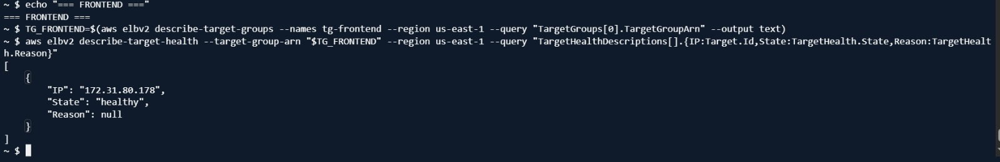
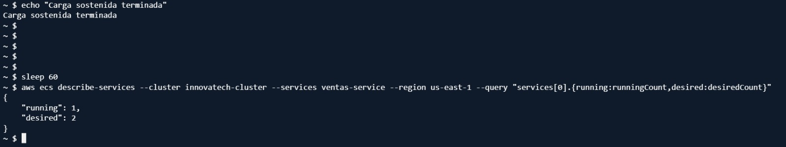

# 07. Observabilidad

## Logs

- **Logs del pipeline CI/CD:** disponibles directamente en la pestaña **Actions** de GitHub, mostrando la ejecución de cada etapa (configuración de credenciales, login a ECR, build/push, y los tres `force-new-deployment`). Se cuenta con evidencia de una ejecución exitosa (**run #21**).
- **Logs de la aplicación desplegada:** disponibles en **Amazon CloudWatch Logs**, asociados a cada tarea de ECS (frontend, ventas, despachos), permitiendo revisar el comportamiento en tiempo real tras cada despliegue.

## Métricas

- **Métricas de CPU por servicio ECS**, usadas directamente como base para el autoscaling (`ECSServiceAverageCPUUtilization`).
- **Estado de salud (health status)** de cada Target Group en el ALB: se verificó que `ventas`, `despachos` y `frontend` estuvieran en estado **healthy** antes y durante la prueba de carga.
- **Evidencia de autoscaling en acción:** curva de CPU superando el 50% sostenido durante ~4 minutos, seguida del incremento de `desiredCount` de `ventas-service` de 1 a 2 tareas.

## Qué se demuestra con esta observabilidad

1. El sistema está efectivamente desplegado y respondiendo (health checks healthy).
2. El pipeline se ejecuta de forma trazable y auditable (logs de GitHub Actions).
3. El autoscaling reacciona a condiciones reales de carga, no es solo una configuración teórica (métricas de CloudWatch + cambio real de `desiredCount`).

